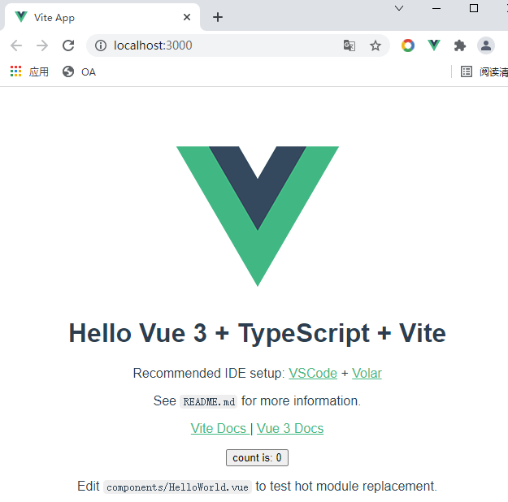

# learn vite

## 1. hello world

创建 “Vue3 + TypeScript + Vite” 的项目 “01-hello-world”：


```shell
PS D:\dev\learn\learn-vite> npm init vite@latest
Need to install the following packages:
  create-vite@latest
Ok to proceed? (y) y
√ Project name: ... 01-hello-world
√ Select a framework: » vue
√ Select a variant: » vue-ts

Scaffolding project in D:\dev\learn\learn-vite\01-hello-world...

Done. Now run:

  cd 01-hello-world
  npm install
  npm run dev

```

安装依赖：

```shell
PS D:\dev\learn\learn-vite> cd .\01-hello-world\
PS D:\dev\learn\learn-vite\01-hello-world> npm i
```

启动：

```shell
PS D:\dev\learn\learn-vite\01-hello-world> npm run dev
```

打开网址（`http://localhost:3000/`）：



